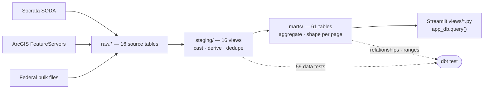

# Robbins — Seattle-Metro Open-Data Explorer

**Robbins** is an interactive, multi-page [Streamlit](https://streamlit.io) app
that explores free public datasets about the **Seattle metro** (King County core,
extending to Pierce & Snohomish) — maps, trends, and searchable tables in one place.

**Live:** https://robbins-production.up.railway.app

It's a portfolio piece demonstrating end-to-end data engineering: multi-source
ingestion across **three access patterns** (Socrata SODA API, ArcGIS FeatureServers,
and keyless federal bulk files), a reproducible DuckDB warehouse, dbt modeling, and
an interactive front end. It began as a near-exact port of Elvis (Las Vegas) — same
stack, different city — then grew a third ingestion pattern for federal data.

## Stack

- **DuckDB** — single-file embedded warehouse (no server).
- **dbt-duckdb** — SQL modeling: `staging/` views normalize raw sources,
  `marts/` tables aggregate and denormalize for the app.
- **Streamlit** + **Altair** (charts) + **PyDeck** (maps).
- **uv** for Python; **Docker** → **Railway** for deploy.

## How it works

```
build_warehouse.py   # fetch every public source -> raw.* tables in seattle.duckdb
        │            #   Socrata (SODA API) for city/county tabular data
        │            #   ArcGIS FeatureServers for GIS spatial layers (parks, art)
        │            #   Keyless federal bulk files (NOAA, EPA, USGS, NRCS)
     dbt build       # raw -> staging views -> marts tables
        │
streamlit_app.py     # views/*.py pages query marts via cached app_db.query()
```

The DuckDB warehouse is **baked at Docker build time** (`build_warehouse.py` then
`dbt build`), so the running container serves a ready warehouse. The `.duckdb` file
is a git-ignored build artifact, rebuilt fresh on every deploy — so each deploy
ships the latest upstream data.

The net-new piece versus Elvis is **`fetch_socrata()`** — Seattle's dominant
open-data portal is Socrata (`data.seattle.gov`, `data.kingcounty.gov`), reached via
the SODA API — alongside a set of federal-feed fetchers (NOAA GHCN weather, EPA AQS
air quality, USGS streamflow, NOAA tides, NRCS snowpack). All Seattle-specific
configuration lives in **`city_config.py`**, so re-pointing to another metro is
ideally a one-file change.

## Data modeling

The warehouse is a **two-tier dbt contract**: 16 `staging/` views normalize each raw
source (cast text to typed columns, derive fields, dedupe), and 61 `marts/` tables
aggregate and shape those into exactly what each page renders. The Streamlit app only
ever reads marts — never `raw.*` or staging — so the SQL that shapes the data lives in
one place, version-controlled and tested, rather than scattered through the app.



Example lineage — the Building Permits page: `raw.building_permits` →
`stg_building_permits` (view) → `mart_permits_by_class`, `mart_permits_monthly`,
`mart_permits_map_sample` (tables) → the permits view.

**Documentation & tests.** Every source, staging model, and mart is documented in
`models/**/schema.yml` (source-table docs live in `models/staging/sources.yml`), with
column-level descriptions for the full marts surface the app consumes. **59 dbt data
tests** enforce `not_null`/`unique` on verified natural keys, `accepted_values` on
categoricals, `dbt_utils.accepted_range` (AQI 0–500, metro-bbox lat/lon), and
`relationships` from the map samples back to their staging keys — with known-dirty
columns tested at `warn` severity so caveats surface without failing the build. CI
runs `dbt parse` on every push; `dbt test` runs against a locally built warehouse.

```sh
uv run dbt deps                              # install dbt-utils (first run)
uv run dbt test  --profiles-dir .            # run the 59 data tests
uv run dbt docs generate --profiles-dir .    # build the catalog + lineage
uv run dbt docs serve                        # browse models, columns, and the DAG
```

## Run it locally

```sh
uv sync
uv run dbt deps                             # install dbt packages (dbt-utils)
uv run python build_warehouse.py            # fetch sources -> raw.* tables
uv run dbt build --profiles-dir .           # raw -> staging -> marts (+ tests)
uv run streamlit run streamlit_app.py       # serve on :8501
```

Quality gates (also enforced by `prek` pre-commit hooks and GitHub Actions CI):

```sh
uv run pytest          # TDD for parsers/transforms (fetch_socrata et al.)
uv run ruff check .
uv run ty check
uv run prek install    # optional: install the git hooks (ruff + ty on commit,
                       # pytest on push)
```

## Data sources

Public, no secrets. A Socrata app token is optional (raises rate limits only). The
Vegas→Seattle source mapping and known gotchas are in [`PRIMER.md`](./PRIMER.md);
the task board is [`TASKS.md`](./TASKS.md).

Fifteen topics across three ingestion patterns:

| Page | Source | Pattern |
| --- | --- | --- |
| Overview | (aggregates all marts) | — |
| Building Permits | Seattle DCI Building Permits (`76t5-zqzr`) | Socrata |
| Crime | SPD Crime (`tazs-3rd5`, CSV export) | Socrata |
| Fire 911 Calls | Seattle Real-Time Fire 911 (`kzjm-xkqj`) | Socrata |
| 311 Requests | Seattle Customer Service Requests / Find-It-Fix-It (`5ngg-rpne`, CSV export) | Socrata |
| Restaurant Inspections | Public Health – Seattle & King County (`r878-4sxa`) | Socrata |
| Short-Term Rentals | Seattle STR licenses (`s7df-xba4`) | Socrata |
| Business Licenses | Active business license certs (`wnbq-64tb`) | Socrata |
| Public Art | Seattle Office of Arts & Culture (`PublicArt2`) | ArcGIS |
| Parks | Seattle Parks boundaries (`Park_Boundaries`) | ArcGIS |
| Street Trees | SDOT tree inventory (`SDOT_Trees_(Active)`, ~212k) | ArcGIS |
| Rain & Records | NOAA GHCN-Daily, Sea-Tac (`USW00024233`) | Federal bulk |
| Air Quality | EPA AQS daily PM2.5 + Ozone (King/Pierce/Snohomish) | Federal bulk |
| Water | USGS streamflow + NOAA tides + NRCS SNOTEL snowpack | Federal bulk |
| Transit Ridership | FTA National Transit Database (`8bui-9xvu`, Puget Sound agencies) | Federal (Socrata) |
| Ferry Ridership | FTA NTD ferry mode — WSF + King County Water Taxi | Federal (Socrata) |

Two topics were **dropped for lack of a machine-readable Seattle source** (and
logged in `city_config.py`): Marriage Licenses and Tourism (no open Sea-Tac
passenger feed — the **Ferry Ridership** page is its Puget-Sound-travel stand-in).

## Deploy

Railway, from the `Dockerfile` (no Procfile, no `railway.toml`). The build stage
runs `build_warehouse.py && dbt build --profiles-dir .` to bake the warehouse into
the image; the runtime serves Streamlit on `$PORT`.
